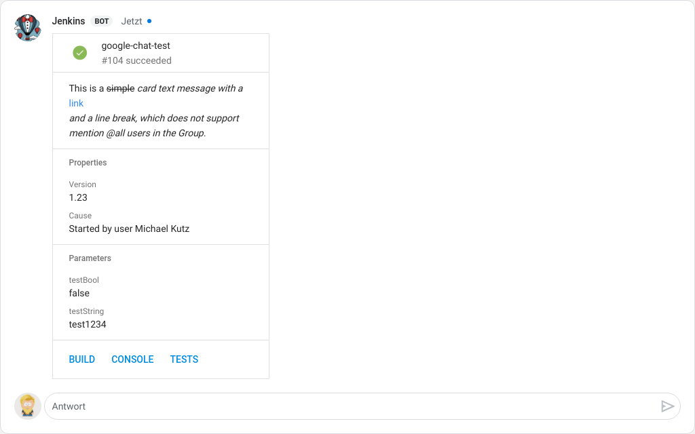

# Jenkins Test Results Notification (work in progress!)

This repository can be used as a [Shared Library][Shared Libraries] by [Jenkins]. It implements different steps to be used in a [Jenkins Pipeline] to send messages to [Google Chat Service] Groups.

## Setup

1. Add this repository to your Jenkins Global Pipeline Libraries as described [here][Using Libraries].
2. Make sure that the [HTTP Request Plugin] is installed on your Jenkins. This library relies on it to send messages to [Google Chat Service]
3. Use the library in your Jenkinsfile. Either check load implicitly or using a `@Library` annotation (see [Using Libraries] for details).
4. Configure a Webhook in your Google Chat Room and copy the URL.
5. In your Jenkinsfile either set an environment variable and assign the URL to it.\
   If you name that variable `GOOGLE_CHAT_URL`, it will be used automatically by the steps of this library, otherwise you will need to pass it as a parameter, which might be useful to send messages to different Groups.\
   Note that anyone knowing the URL will be able to send messages via your Webhook, so you _should_ configure the URL as a secret text in your Jenkins' credentials section to keep it out of you version control and the Jenkins logs. See [Using Credentials].
5. Use the steps as described below.

## Steps

### `sendGoogleChat`

This step can be used to send [Simple Message]s. It takes the message as its only mandatory parameter. As a second parameter you can pass the Webhook URL or you can define it in an environment variable named `GOOGLE_CHAT_URL`.

#### Parameters

- `String message` (mandatory): The text message to be sent. You can use any formatting as described [here][Simple Message].
- `String url` (optional): the Google Chat Webhook URL to be used. Needs to be defined, if `env.GOOGLE_CHAT_URL` is not set!``

#### Example

```groovy
sendGoogleChat("This is a _simple_ text message " +
    "with a <https://github.com/mkutz/jenkins-google-chat-notification|link>" +
    "\nand a line break, " +
    "which might be interesting to <users/all> users in the Group.")
```


### `sendGoogleChatBuildReport`

This step sends a bunch of data about the build as a [Card Message].

#### Parameters

- `Map<String, String> buildProperties` (optional): adds the given data as [KeyValue Widget]s to the [Card Message]. If there is a key `message` it will be added as a [Text Paragraph Widget] instead.
- `String url` (optional): the Google Chat Webhook URL to be used. Needs to be defined, if `env.GOOGLE_CHAT_URL` is not set!``

#### Example

```groovy
sendGoogleChatBuildReport(version: env.VERSION)
```


[Google Chat Service]: <https://developers.google.com/hangouts/chat/>
[Simple Message]: <https://developers.google.com/hangouts/chat/reference/message-formats/basic>
[Card Message]: <https://developers.google.com/hangouts/chat/reference/message-formats/cards>
[Text Paragraph Widget]: <https://developers.google.com/hangouts/chat/reference/message-formats/cards#textparagraph>
[KeyValue Widget]: <https://developers.google.com/hangouts/chat/reference/message-formats/cards#keyvalue>

[Jenkins]: <https://jenkins.io> 
[Shared Libraries]: <https://jenkins.io/doc/book/pipeline/shared-libraries/>
[Jenkins Pipeline]: <https://jenkins.io/doc/book/pipeline/>
[Using Libraries]: <https://jenkins.io/doc/book/pipeline/shared-libraries/#using-libraries>
[Using Credentials]: https://jenkins.io/doc/book/using/using-credentials/

[HTTP Request Plugin]: <https://plugins.jenkins.io/http_request>